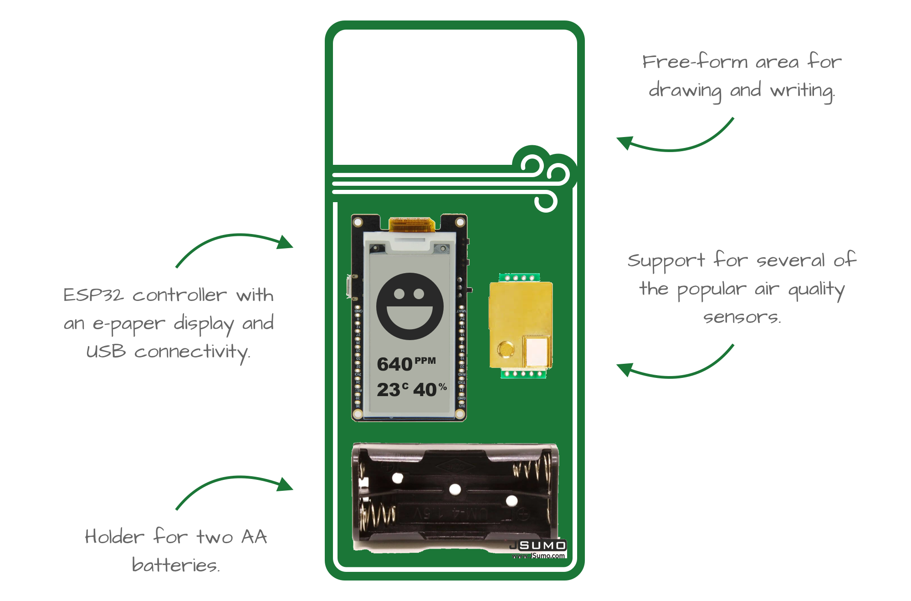

# Air Guard 💨

Air Guard is a do-it-yourself electronics kit for building an **air quality monitor** for your school, home or office.

## Contribute

Join our [chat on Gitter](https://gitter.im/open-lv/air-guard) to discuss ways to contribute. Issues and pull requests are always welcome!

## Credits

Created [by contributors](https://github.com/open-lv/air-pilot/graphs/contributors) and licenses under [MIT](https://opensource.org/licenses/MIT).