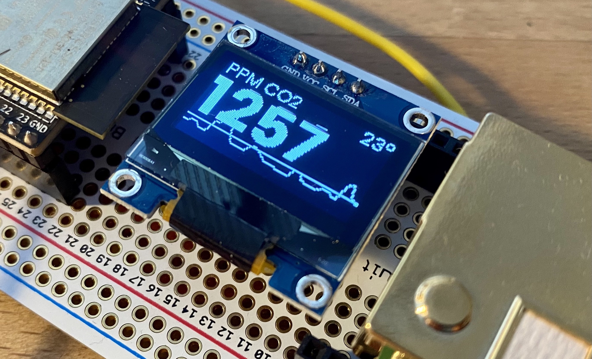

# ESPHome Firmware for Air Guard

See [`air-guard.yaml`](air-guard.yaml) for the firmware configuration.

## Requirements

See the [ESPHome setup instructions](https://esphome.io/guides/getting_started_command_line.html) for how to install the required tooling to compile and upload the firmware. Alternatively, see the "Build and Upload" section below for how to use the ESPHome Docker container to build and upload the firmware.

## Setup

The following pins are used to attach sensors and devices to ESP32:

- MH-Z19B CO2 sensor is connected to UART pins 16 for RX and 17 for TX.
- SSD1306 OLED display is connected to the I2C pins 21 for SDA and 22 for SCL.

## Build and Upload

Copy `secrets.yaml.example` to `secrets.yaml` and configure your WiFi name and password.

Run the following command to build and upload the firmware using the [`esphome` command-line utility](https://esphome.io/guides/cli.html):

    esphome run air-guard.yaml

Alternatively, use the ESPHome Docker container to do the same:

    docker run --rm --volume "${PWD}":/config --device=/dev/ttyUSB0 --privileged --interactive --tty esphome/esphome run air-guard.yaml

where `/dev/ttyUSB0` is the absolute path to the serial interface on the host computer to be shared with the Docker container for uploading the firmware. The `--privileged` flag might not be necessary depending on your operating system and Docker configuration.
